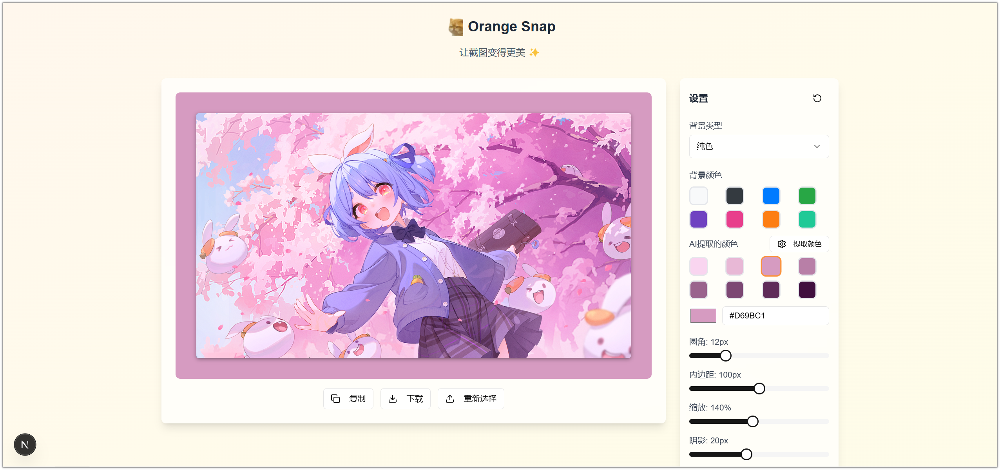

# Orange-Snap

简洁实用的截图美化工具，让截图变得更美✨



## 环境变量配置

为了使用 AI 颜色提取功能，您需要配置以下环境变量：

1. 在项目根目录创建 `.env.local` 文件
2. 添加以下配置：

```
# OpenAI Configuration
OPENAI_API_KEY=your_openai_api_key_here
OPENAI_BASE_URL=https://api.openai.com/v1
AI_MODEL=gemini-2.0-flash
```

注意：
- `OPENAI_API_KEY` 是必需的，用于访问 OpenAI API
- `OPENAI_BASE_URL` 是可选的，仅在需要使用自定义 API 端点时设置
- `AI_MODEL` 是可选的，用于指定使用的 AI 模型，默认为 'gemini-2.0-flash'，可选值包括 'gpt-4-vision-preview' 等

## 开发

```bash
pnpm run dev
```

## 构建

```bash
pnpm run build
pnpm start
```